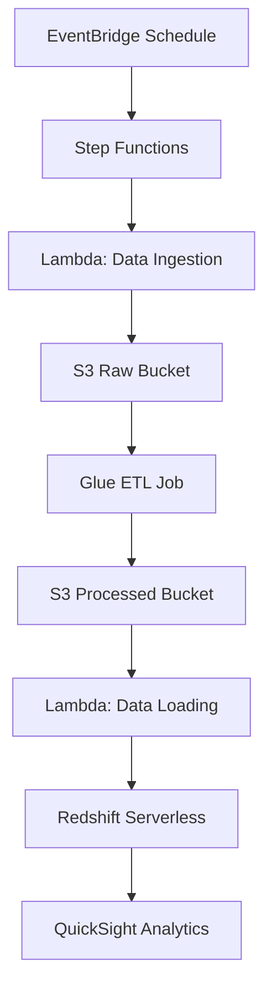

# Citibike Data Pipeline on AWS 🚴‍♂️


An end-to-end serverless data pipeline for processing Citibike trip data. Built with AWS CloudFormation, Glue, Lambda, Redshift, and Step Functions.

---

## Table of Contents
- [Project Overview](#project-overview)
- [Architecture Diagram](#architecture-diagram)
- [Pipeline Steps](#pipeline-steps)
- [Features](#features)
- [Prerequisites](#prerequisites)
- [Deployment](#deployment)
- [Configuration](#configuration)
- [Usage](#usage)
- [Monitoring](#monitoring)
- [Troubleshooting](#troubleshooting)
- [References](#references)

---

## Project Overview

This project automates the **ETL (Extract, Transform, Load)** process for [Citibike's public datasets](https://www.citibikenyc.com/system-data). It ingests raw trip data, processes it using PySpark, and loads it into a Redshift data warehouse for analytics. The pipeline is orchestrated using AWS Step Functions and triggered on a schedule via Amazon EventBridge.

### Key Components:
- **Data Ingestion**: Automatically download and store raw data in S3.
- **Data Processing**: Clean, transform, and enrich data using AWS Glue and PySpark.
- **Data Loading**: Load processed data into Redshift Serverless.
- **Orchestration**: Automate the pipeline using Step Functions and EventBridge.
- **Analytics**: Visualize data using Amazon QuickSight.

---

## Architecture Diagram



---

## Pipeline Steps

### 1. **Data Ingestion**
- **What Happens**:
  - A Lambda function downloads the latest Citibike dataset (in `.zip` format) from the public S3 bucket.
  - The function unzips the file and uploads the `.csv` files to the `citibike-raw-data` S3 bucket.
- **Tools Used**:
  - AWS Lambda (Python)
  - Amazon S3

### 2. **Data Processing**
- **What Happens**:
  - An AWS Glue job reads the raw `.csv` files from the `citibike-raw-data` bucket.
  - The data is cleaned, transformed, and enriched using PySpark.
  - Processed data is saved in Parquet format to the `citibike-processed-data` bucket.
- **Key Transformations**:
  - Remove duplicates and handle missing values.
  - Calculate trip distance using the Haversine formula.
  - Create dimension tables (`stations_dim`, `users_dim`, `time_dim`, etc.).
- **Tools Used**:
  - AWS Glue (PySpark)
  - Amazon S3

### 3. **Data Loading**
- **What Happens**:
  - A Lambda function loads the processed Parquet files from the `citibike-processed-data` bucket into Redshift.
  - The `COPY` command is used for efficient bulk loading.
- **Tools Used**:
  - AWS Lambda (Python)
  - Amazon Redshift

### 4. **Orchestration**
- **What Happens**:
  - AWS Step Functions orchestrates the pipeline, ensuring each step runs in sequence.
  - Amazon EventBridge triggers the pipeline on a schedule (e.g., monthly).
- **Tools Used**:
  - AWS Step Functions
  - Amazon EventBridge

### 5. **Analytics**
- **What Happens**:
  - Data is queried and analyzed in Redshift.
  - Dashboards are created in Amazon QuickSight for visualization.
- **Tools Used**:
  - Amazon Redshift
  - Amazon QuickSight

---

## Features
- **Infrastructure-as-Code**: Full CloudFormation template for deployment.
- **Serverless**: No EC2 instances to manage.
- **Scalable**: Handles 100GB+ datasets.
- **Cost-Effective**: Pay-per-use pricing.
- **Data Quality Checks**:
  - Duplicate removal.
  - Null value handling.
  - Schema validation.

---

## Prerequisites

1. **AWS Account** with:
   - Admin IAM permissions.
   - Default VPC configured.
2. **AWS CLI** installed and configured.
3. **Python 3.9+** for Lambda functions.
4. **PySpark 3.1+** for Glue script.

---

## Deployment

### 1. Clone Repository
```bash
git clone https://github.com/your-username/citibike-data-pipeline.git
cd citibike-data-pipeline
```

### 2. Package Glue Script
```bash
aws s3 cp src/glue_processing.py s3://your-bucket/scripts/citibike_processing.py
```

### 3. Deploy CloudFormation Stack
```bash
aws cloudformation deploy \
  --template-file infra/citibike-pipeline.yaml \
  --stack-name citibike-prod \
  --parameter-overrides \
    GlueScriptS3Path="s3://your-bucket/scripts/citibike_processing.py" \
  --capabilities CAPABILITY_NAMED_IAM
```

### 4. Verify Resources
```bash
aws cloudformation describe-stacks --stack-name citibike-prod
```

---

## Configuration

### CloudFormation Parameters
| Parameter              | Description                     | Default Value               |
|------------------------|---------------------------------|-----------------------------|
| `RawDataBucket`        | Raw CSV storage                | `citibike-raw-data`         |
| `ProcessedDataBucket`  | Processed Parquet storage      | `citibike-processed-data`   |
| `RedshiftNamespace`    | Serverless namespace           | `citibike-namespace`        |
| `ScheduleExpression`   | Pipeline trigger schedule      | `cron(0 12 1 * ? *)`        |

### Environment Variables
```yaml
# In Lambda functions
Variables:
  REDSHIFT_HOST: !GetAtt RedshiftWorkgroup.Endpoint.Address
  REDSHIFT_PORT: !GetAtt RedshiftWorkgroup.Endpoint.Port
```

---

## Usage

### Sample Redshift Queries

1. **Top 10 Busiest Stations**:
```sql
SELECT start_station_id, COUNT(*) AS trips 
FROM trips_fact
GROUP BY 1
ORDER BY 2 DESC
LIMIT 10;
```

2. **Average Trip Duration by User Type**:
```sql
SELECT user_type, AVG(trip_duration_seconds)/60 AS avg_minutes
FROM trips_fact
GROUP BY 1;
```

### QuickSight Setup
1. Create new dataset → Redshift.
2. Connect to your Redshift workgroup.
3. Build dashboards using:
   - `trips_fact` table.
   - `time_dim` for time-series analysis.

---

## Monitoring

1. **CloudWatch Metrics**:
   - Glue Job Duration.
   - Redshift Query Performance.
   - Lambda Invocations.

2. **Alerting**:
```bash
aws cloudwatch put-metric-alarm \
  --alarm-name "GlueJobFailures" \
  --metric-name "FailedExecutionCount" \
  --namespace "AWS/Glue" \
  --threshold 1 \
  --comparison-operator GreaterThanOrEqualToThreshold
```

---

## Troubleshooting

| Error | Solution |
|-------|----------|
| `Spectrum Scan Error` | Verify Parquet schema matches Redshift table. |
| `Connection timed out` | Check Redshift security group inbound rules. |
| `MAXERROR not supported` | Remove `MAXERROR` from COPY command. |
| `Lambda timeout` | Increase timeout to 5+ minutes. |

---

## References
1. [Citibike System Data](https://www.citibikenyc.com/system-data)
2. [AWS Glue Developer Guide](https://docs.aws.amazon.com/glue/latest/dg/what-is-glue.html)
3. [Redshift COPY Command Docs](https://docs.aws.amazon.com/redshift/latest/dg/r_COPY.html)
4. [Mermaid Diagram Syntax](https://mermaid-js.github.io/mermaid/#/)
```